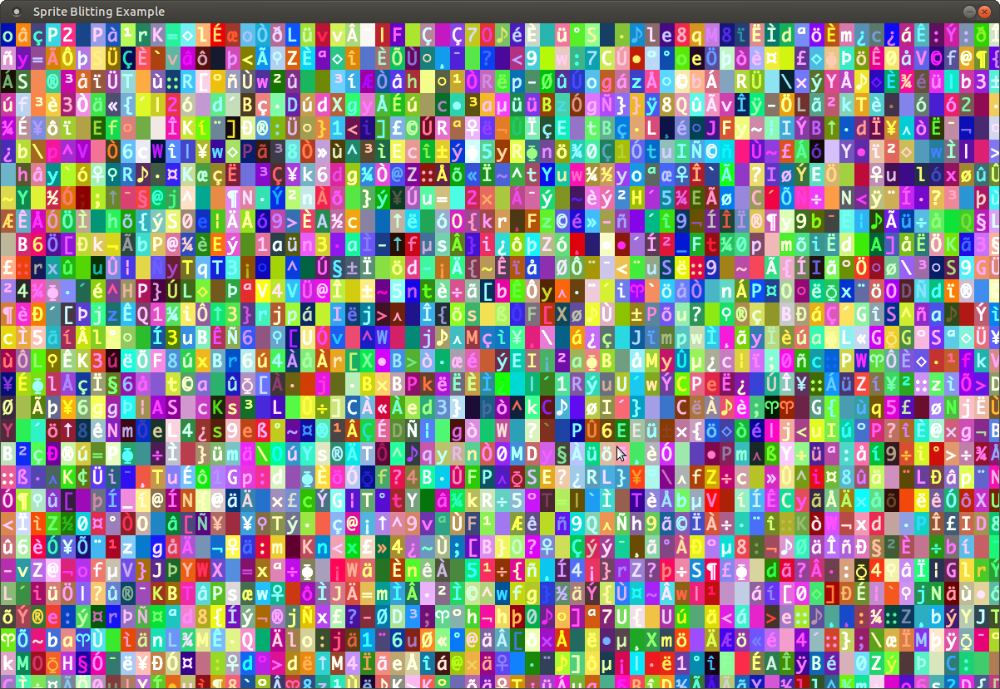

# Sprite Blitting for C using SDL2

A simple program that shows how to blit sprites from a spritesheet
to the screen using the standard [SDL2](http://www.libsdl.org) and [SDL2_image](https://www.libsdl.org/projects/SDL_image/) libraries.

* Loading a spritesheet
* Setting the transparent color on the spritesheet
* Blitting a portion of the spritesheet (a sprite) to a double buffer
* Tinting the sprite a certain color
* Clamping the render framerate to once a second

